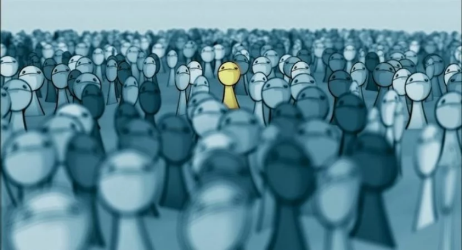

== Dimensão Profissional

=== Egressos

O propósito das escolas de curso técnico profissionalizante é preparar o estudante para a vida profissional. No entanto, enquanto o aluno que ainda está na escola as vezes não se percebe sendo preparado para sua vida profissional. Isso é mais verdade principalmente quando realiza um curso que não deseja atuar na área técnica.

Virão pressão de todos os lados, _vai trabalhar com o que_? Principalmente para o aluno que não passou no ENEM.

Espero que possa aprender algo com os nossos ex-alunos...

[quote, Carol]
____
Na dimensão profissional, enfrentei as seguintes dificuldades:
*adaptação na área escolhida e no novo universo da Universidade Federal*.

Eu me senti *Assustada*.

Para superar essas dificuldades eu *estudei muito, procurei ajuda profissional em relação à saúde mental*.

O principal aprendizado que gostaria de compartilhar é *levar em consideração todo aprendizado passado no Instituto Federal*.
____

[quote, Sezinho]
____

Na dimensão profissional, enfrentei as seguintes dificuldades: *Dificuldade de achar emprego*.

Eu me senti… *Impotente*.

Para superar essas dificuldades eu… *Esperei*.

O principal aprendizado que gostaria de compartilhar é… *Persistência*.
____

[quote, Sistriana]
____
Na dimensão profissional, enfrentei as seguintes dificuldades: *Falta de trabalho em equipe, cooperação*.

Eu me senti… *Irritada*.

Para superar essas dificuldades eu… *tentei conversar*.

O principal aprendizado que gostaria de compartilhar é… *que deve-se ter uma cooperação de todos para que um trabalho seja feito corretamente*.

____

[quote, Menina dezoito]
____
Na dimensão profissional, enfrentei as seguintes dificuldades:

- Desvalorização do técnico em meio ambiente no mercado de trabalho.
- Falta de recomendação trabalhista.

Eu me senti…

- Sentimento de perda de tempo em relação ao curso.
- Frustrada.
- Triste.

Para superar essas dificuldades eu… *procurei me adaptar ao mercado de trabalho vivendo profissões mais variáveis e autônomas, onde eu pudesse ter minha independência financeira*.

O principal aprendizado que gostaria de compartilhar é… *Faça tudo que tiver de fazer com perfeição, ou tudo será perda de tempo*.
____

[quote, "Pan, A coisa"]
____
Na dimensão profissional, enfrentei as seguintes dificuldades: *Desvalorização do técnico em meio Ambiente, sou meio vagabundo, então… pode ser isso. Mas não me arrependo de ter feito, mudei como ser humano*.

Eu me senti… *Meio triste, meio feliz na metade do caminho, agora só tô conformado*.

O principal aprendizado que gostaria de compartilhar é… *Não importa as dificuldades, sempre vai aparecer uma pior, então aguenta filho (a)*.

____

== Dimensão Relacionamentos Pessoais

=== Egressos

[quote, Carol]
____

Nas relações pessoais, enfrentei as seguintes dificuldades: *Não tive*.

Eu me senti… *Sociável*.

Para superar essas dificuldades eu… *fiz amizades e laços novos*.

O principal aprendizado que gostaria de compartilhar é… *importante ter amigos que deem apoio*.

____

[link=https://www.flickr.com/photos/javh/5448336655]

[quote, Tompero]
____

Nas relações pessoais, enfrentei as seguintes dificuldades: *Uma certa fobia social me acompanha*.

Eu me senti… *Perdido em meio a multidão*.

Para superar essas dificuldades eu… *Estou tentando melhorar*.

O principal aprendizado que gostaria de compartilhar é… *Só você pode fazer algo para ajudar a si mesmo*.
____

[quote, Juliano]
____

Nas relações pessoais, enfrentei as seguintes dificuldades: *Amizades tóxicas e problemas emocionais*.

Eu me senti… *Nada bem*.

Para superar essas dificuldades eu… *Aprendi a me amar e pensar em mim antes de tudo*.

O principal aprendizado que gostaria de compartilhar é… *Nunca desista de você mesmo, você não precisa de ninguém*.

____

[quote, Senhorita Sorriso]
____

Nas relações pessoais, enfrentei as seguintes dificuldades: *Já me senti muito excluída de momentos e senti pessoas se afastando, por eu ser muito falante e sorridente…*

Eu me senti… *triste, pois eles me julgaram sem nem saber as dificuldades que eu superava para continuar sorrindo.*

Para superar essas dificuldades eu… *observei que mesmo com tudo acontecendo eu precisava continuar do jeito que sou sorrindo. (Mesmo que sua felicidade incomode os outros, continue a sorrir!)*

O principal aprendizado que gostaria de compartilhar é… *Não é porque as pessoas não gostam do seu jeito que você deve mudar! Você deve continuar sendo sorridente e feliz. Você só deve mudar se for por você, para seu amadurecimento e crescimento. Seja feliz!*
____

[quote, Sistriana]
____
Nas relações pessoais, enfrentei as seguintes dificuldades: *Falta de diálogos e entendimento*.

Eu me senti… *Triste e decepcionada*.

Para superar essas dificuldades eu… *Decidi tentar reconciliações e coisas enfrentantes*.

O principal aprendizado que gostaria de compartilhar é… *Talvez não lidamos muito bem com todo mundo, mas o importante é manter a consciência tranquila*.
____

[quote, Menina dezoito]
____
Nas relações pessoais, enfrentei as seguintes dificuldades: *Traíram, traí também, sofri, chorei, e hoje sou apaixonada por 2 pessoas, estou recebendo amor em dobro, superei*!

Eu me senti… *Meio mal, mas nada que um litro de chicletinho não resolve-se*.

Para superar essas dificuldades eu… *Fiz curso e iludi*.

O principal aprendizado que gostaria de compartilhar é… *Viva! INTENSAMENTE*!
____

[quote, Pan (a coisa)]
____

Nas relações pessoais, enfrentei as seguintes dificuldades: *Briguei, xinguei, beijei, superei chifres, botei chifre*.

Eu me senti… *Nem sei o que "tô" sentindo até agora*.

Para superar essas dificuldades eu… *Álcool é bom, né?*

O principal aprendizado que gostaria de compartilhar é… *Viva tudo, experimente tudo. A vida é um buffet de graça, entre e aproveite*.

____

[quote, Cipriano]
____
Nas relações pessoais, enfrentei as seguintes dificuldades: *Timidez e falta de entendimento*.

Eu me senti… *Um pouco frustrado*.

Para superar essas dificuldades eu… *Busquei me comunicar mais com as pessoas*.

O principal aprendizado que gostaria de compartilhar é… *Independente das barreiras, nunca desista*.
____

[quote, "@melo.ian"]
____

Nas relações pessoais, enfrentei as seguintes dificuldades: *No início em 2016, por conta que não nos conhecíamos, demorou um pouco para criarmos laços*.

Eu me senti… *um pouco afastado, mas depois fizemos amizades que permaneceu*.

Para superar essas dificuldades eu… *Se envolver e conversar com o pessoal*.

O principal aprendizado que gostaria de compartilhar é… *Que independente das dificuldades, nunca desista*.

____

== Dimensão Familiar

=== Egressos

[quote, Carol]
____

Nas relações familiar, enfrentei as seguintes dificuldades: *Não tive*.

Eu me senti… *Normal*.

Para superar essas dificuldades eu… *Conversei com minha mãe*.

O principal aprendizado que gostaria de compartilhar é… *Família é importante*.

____

[quote, Tompero]
____

Nas relações familiar, enfrentei as seguintes dificuldades: *Comunicação*.

Para superar essas dificuldades eu… *Não superei ainda*.
____

[quote, Senhorita Sorriso]
____

Nas relações familiar, enfrentei as seguintes dificuldades: *perdi meu pai e muitas pessoas ignoraram minha dor.*

Eu me senti… *muito triste pois, não tivemos uma conversa antes dele partir e muitas pessoas não compreenderam meu momento*.

Para superar essas dificuldades eu… *estou em fase de superar, mas acredito que dando orgulho a ele, sendo bem sucedida, pois sei que ele iria se orgulhar de mim*.

O principal aprendizado que gostaria de compartilhar é… *existem momentos que nos deixam abalados e pode até ser um momento que as pessoas não estejam ao seu lado, porém é de grande importância você depender do que os outros pensam, mas do que você sente. Supere e seja feliz sem depender da opinião dos outros.*

____

[quote, Sistriana]
____
Nas relações familiar, enfrentei as seguintes dificuldades: *Falta de compreensão, discussão e desentendimentos*.

Eu me senti… *Triste e desestimulada*.

Para superar essas dificuldades eu… *Decidi mostrar os problemas e tentar me abrir, também busquei ajuda de outras pessoas*.

O principal aprendizado que gostaria de compartilhar é… *Às vezes não entendemos as tamanhas preocupações de nossos responsáveis, e em alguns momentos somente nós mesmos entendemos nossas dificuldades*.
____

[quote, Menina dezoito]
____
Nas relações familiar, enfrentei as seguintes dificuldades:

- Desvalorização do meu curso
- Falta de compreensão
- Falta de respeito

Eu me senti… *PUTA*.

Para superar essas dificuldades eu… *Entrei em depressão*.

O principal aprendizado que gostaria de compartilhar é… *Invés de ficar desesperada chorando, meta a cara, vai pra rua procurar. CERTEZA que você encontrará algo, mas nada vem fácil. E outra, sair e beber ajuda*.
____

[quote, Cipriano]
____
Nas relações familiar, enfrentei as seguintes dificuldades: *Não enfrentei nenhum problema significativo, a não ser pelas notas*.

Eu me senti… *Normal à respeito disso*.

Para superar essas dificuldades eu… *Estudei mais para recuperar as notas*.

O principal aprendizado que gostaria de compartilhar é… *Tente sempre dar seu melhor e se esforçar sempre*.
____

[quote, "@melo.ian"]
____
Nas relações familiar, enfrentei as seguintes dificuldades: *Houve um afastamento, não conseguia ver muito eles, por causa da rotina*.

Eu me senti… *Mais forte, por conta que me senti mais independente*.

Para superar essas dificuldades eu… *Quando tinha tempo sobrando, passava com eles*.

O principal aprendizado que gostaria de compartilhar é… *Seus pais sempre vão estar ao seu lado te apoiando, mesmo longe*.

____

== Dimensão Escolar/Acadêmica

=== Egressos

[quote, Carol]
____

Na dimensão acadêmica, enfrentei as seguintes dificuldades: *Dificuldade na adaptação*.

Eu me senti… *Assustada e insuficiente*.

Para superar essas dificuldades eu… *Procurei ajuda e estudei*.

O principal aprendizado que gostaria de compartilhar é… *levar em consideração toda a experiência no Instituto Federal*.

____

[quote, Senhorita Sorriso]
____
Na dimensão acadêmica, enfrentei as seguintes dificuldades: *a Universidade é um mundo de oportunidades, todavia podemos perceber que teremos que alcançar tudo com o nosso esforço*.

Eu percebi que *os professores estão apenas focados em dar o conteúdo e notas. (São poucos que procuram os alunos para perguntar como se sente). Isso me chocou no início, mas depois eu comecei a correr para atingir minhas metas*.

Para superar essas dificuldades eu… *comecei a estudar mais e procurar mais os professores para quebrar a barreira que existia*.

O principal aprendizado que gostaria de compartilhar é… *procurar os docentes foi uma ótima ideia, pois abriu oportunidades de projetos*.

____

[quote, Sistriana]
____
Na dimensão acadêmica, enfrentei as seguintes dificuldades: *Falta de cooperação em alguns momentos e ajuda de alguns profissionais*.

Eu me senti… *Triste*.

Para superar essas dificuldades eu… *Enfrentei as dificuldades e busquei ajuda*.

O principal aprendizado que gostaria de compartilhar é… *Podemos superar nossas dificuldades sozinhos, mas também uma ajuda externa é crucial*.

____

[quote, Menina dezoito]
____

Na dimensão acadêmica, enfrentei as seguintes dificuldades: *Não passei no Enem*.

Eu me senti… *DERROTADA*.

Para superar essas dificuldades eu… *Estudei*.

O principal aprendizado que gostaria de compartilhar é… *Vou passar*.

____

[quote, Pan (a coisa)]
____
Na dimensão acadêmica, enfrentei as seguintes dificuldades: *A vida acadêmica é fácil, se você superou o Ir, supera tudo amores*.

Eu me senti… *Excitação, frustração (descobri que não tem recuperação)*.

Para superar essas dificuldades eu… *Decidi seguir a onda e é mudar alguns hábitos de estudos, porque recuperação não tem*.

O principal aprendizado que gostaria de compartilhar é… *Estude! Porque para passar na facul na na final precisa de 5 pontos*.

____

[quote, Cipriano]
____
Na dimensão acadêmica, enfrentei as seguintes dificuldades: *Diferença no aprendizado tradicional*.

Eu me senti… *Gostei do muito aprendizado, mesmo com os problemas enfrentados*.

Para superar essas dificuldades eu… *Fui tentando melhorar e romper as dificuldades*.

O principal aprendizado que gostaria de compartilhar é… *Aprendizado para a vida*.
____

[quote, "@melo.ian"]
____

Na dimensão acadêmica, enfrentei as seguintes dificuldades: *Fome, sono, calor, brigas, e transporte. Algumas disciplinas*.

Para superar essas dificuldades eu… *Sempre permaneci, centrado no meu objetivo*.

O principal aprendizado que gostaria de compartilhar é… *Apesar de todas as dificuldades, sempre vai ter pessoas para te apoiar nessa instituição*.

____

== Pessoas

NOTE: As pessoas a seguir foram nossos egressos de 2018.

[cols="3*", options="header"]
|===
| Pseudônimo
| Profissão
| Idade

| Menina dezoito
|
| 18

| Pan, a coisa
| Estudante
| 19

| Cipriano
| Estudante
| 18

| @melo.ian
| Estudante
| 19

|===
