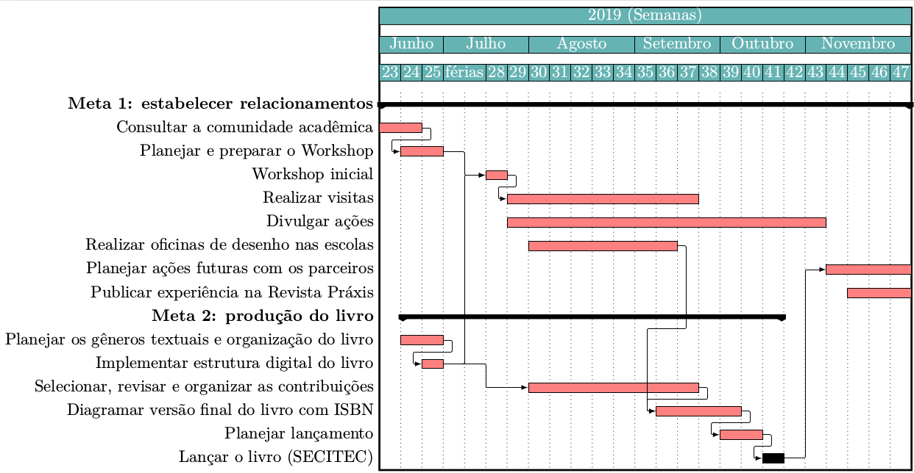
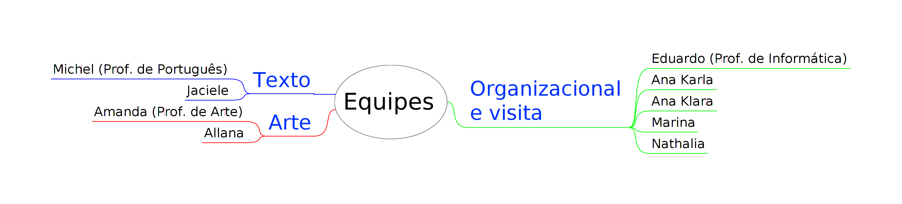

[[prefacio]]
[preface]
== Prefácio

Este livreto teve origem em um projeto de extensão _Sementes de luz: estabelecendo relacionamentos em Santa Rita_, no IFPB, campus de Santa Rita.

O projeto pretendia estabelecer relacionamentos com diversos segmentos da sociedade de Santa Rita (ver <>), e criar parcerias para novas oportunidades de extensão, pesquisa e estágio no território de atuação do campus.

.Segmentos do projeto
[#img-sunset]
[caption="Figure 1: ",link=https://www.flickr.com/photos/javh/5448336655]

=== Cronograma e atividades

As atividades e cronograma original (ver <<cronograma>>) sofreram alterações, mas não impediram a elaboração deste livreto.

.Cronograma Original
[#cronograma]
[caption="Figure 1: ",link=https://www.flickr.com/photos/javh/5448336655]

=== Equipe

Este livro foi produzido graças as ações da equipe do projeto (ver <>).

.Organização dos membros da Equipe
[#img-equipes]
[caption="Figure 1: ",link=https://www.flickr.com/photos/javh/5448336655]

.Membros da equipe
- Allana Barros de Lima
- Amanda Nunes Gomes Meira
- Ana Karla Alves da Silva
- Ana Klara de Sousa Galdino
- Eduardo de Santana Medeiros Alexandre
- Jaciele da Silva Barros
- Marina de Souza Alves Meireles
- Michel Pratini Bernardo da Silva
- Nathalia de França Pereira

[quote, Eduardo de Santana Medeiros Alexandre]
____
Sou grato a todos que contribuíram, direto ou indiretamente, para elaboração deste livro.
____

////
Sempre terminar o arquivo com uma nova linha.
////
